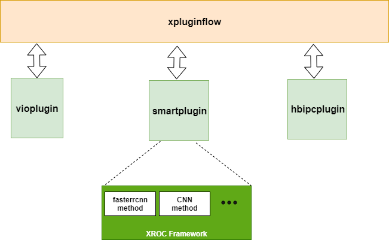

Getting Started with smartplugin    {#smartplugin}
=======

# 简介
Smartplugin是基于XRoc通用sdk接口开发的通用智能化sdk运行框架。
Smartplugin监听viomessage，调用xRoc通用sdk接口得到智能化结果，并把智能化结果以protobuf的方式序列化之后以smartmessage的消息格式发送到总线(xpluginflow)。


# 定制开发
定制开发需要三步：
1. 根据自己的智能化应用需要依赖的xRoc method更新build.properties文件及src/xroc/method_factory.cpp;
2. 根据自己的智能化应用需要输出的智能化结果重写protobuf串行化，即重新实现SmartMessage的Serialize方法。
master分支提供了串行化输出的人脸检测框的sample程序，标准化的protobuf协议在repo xpluginflow_msgtype/include/xpluginflow_msgtype/protobuf/proto/x2.proto。
```
std::string CustomSmartMessage::Serialize() {
  // serialize smart message using defined smart protobuf.
  std::string proto_str;
  x2::FrameMessage proto_frame_message;
  auto smart_msg = proto_frame_message.mutable_smart_msg_();
  smart_msg->set_timestamp_(time_stamp);
  smart_msg->set_error_code_(0);
  // user-defined output parsing declaration.
  HobotXRoc::BaseDataVector *face_boxes = nullptr;
  for (const auto &output : smart_result->datas_) {
    if (output->name_ == "face_bbox_list") {
      face_boxes = dynamic_cast<HobotXRoc::BaseDataVector *>(output.get());
      for (int i = 0; i < face_boxes->datas_.size(); ++i) {
        auto face_box =
            std::static_pointer_cast<HobotXRoc::XRocData<hobot::vision::BBox>>(
                face_boxes->datas_[i]);
        LOGD << "x1: " << face_box->value.x1 << " y1: " << face_box->value.y1
             << " x2: " << face_box->value.x2 << " y2: " << face_box->value.y2
             << " track_id: " << face_box->value.id << "\n";
        auto target = smart_msg->add_targets_();
        target->set_type_("face");
        target->set_track_id_(face_box->value.id);
        auto proto_box = target->add_boxes_();
        proto_box->set_type_("face");
        auto point1 = proto_box->mutable_top_left_();
        point1->set_x_(face_box->value.x1);
        point1->set_y_(face_box->value.y1);
        auto point2 = proto_box->mutable_bottom_right_();
        point2->set_x_(face_box->value.x2);
        point2->set_y_(face_box->value.y2);
      }
    }
  }

  proto_frame_message.SerializeToString(&proto_str);
  return proto_str;
}
```

3. 将编译完成的库替换deploy/xppcp_smart/lib/下的libsmartplugin.so。
  更新xroc workflow配置文件，默认为deploy/configs/smart_config.json
  ```
{
    "xroc_workflow_file": "configs/det_mot.json",
    "enable_profile": 0,
    "profile_log_path": "/userdata/log/profile.txt"
}
```

- xroc_workflow_file: 指定xroc workflow配置文件;
- enable_profile: 是否使能online profile，该feature是xRoc支持的feature，如果method开发中包括了profile信息可通过该开关online使能;
- profile_log_path: online profile 日志输出路径。

将xppcp_smart部署包放在真机上，运行xpp_start.sh 即可启动智能化应用;

其他:
sample/smart_main.cpp即是主程序源码，主程序启动方式为：

>smart_main  [-i/-d/-w/-f] xroc_config_file

-i/-d/-w/-f 分别指定对应info、debug、warning、fatal日志等级。

