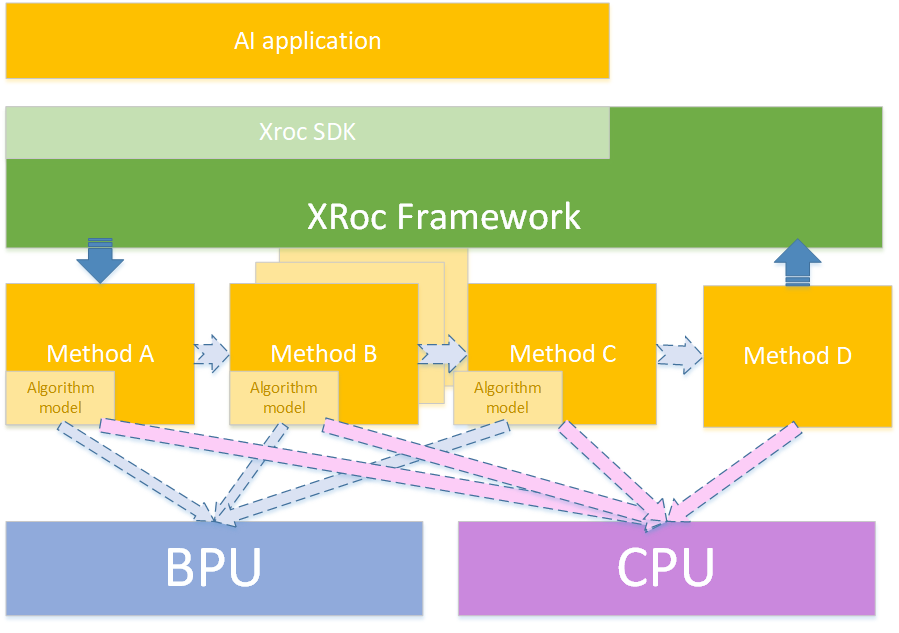

# Overview
## 1 XRoc Framework解决什么问题
降低算法模型，算法策略集成开发的门槛和难度。沉淀和积累智能化工程核心开发能力。


## 2. XRoc Frameowrk 概述
XRoc-Framwork是一种基于数据流的SDK编程框架：
1）可以通过JSON配置构建workflow，workflow是一个有向拓扑图，图中每个节点（Node）都是一个或多个method的实例；
2）method表示一种能力，通常是某类模型能力（人脸检测、人脸Pose等）或者算法策略（过滤策略、融合策略、优选策略等）；
3）workflow表示一个范式，定义了一组能力的串联方式，比如人脸检测、跟踪、属性（pose、blur等）以及优选等能力级联起来可以构建一个人脸抓拍范式；
4）XRoc-Framework定义了一套通用sdk C++接口，通过设置不同的配置文件同一套接口可以运行不同的workflow。


### 2.1 XRoc Framework核心模块
|模块名称或名词  | 描述或解释  |
|:-----:   |:------|
|workflow  | workflow表示一个有向拓扑图，图中每个节点（Node）都是一个或多个method实例；workflow表示一个范式，定义了一组能力的串联方式，比如人脸检测、跟踪、属性（pose、blur等）以及优选等能力级联起来可以构建一个人脸抓拍范式；XRocSDK的SetConfig接口指定的配置文件定义了workflow组织方式。|
|XRocSDK   | 对外SDK类，定义了一套C++ 通用sdk接口，包含创建句柄、初始化、参数配置、同步/异步预测接口、设置回调函数等。|
|Scheduler | workflow的依赖引擎，记录各个Node之间的依赖关系，统一调度各个Node，确保各Node按序完成workflow任务。|
|Node      | method的运行时实例，在thread_safe=false、多线程情况下通常包含多个method实例，多个实例之间默认通过round-bin方式并发处理连续多个任务。|
|MethodManager | 用来管理一个Node内多个Method，包含实例创建、线程池构建及不同阶段调用method对应接口完成初始化、任务分发、参数配置等工作。 |
|Method    |  method表示一种能力，通常是某类模型能力（人脸检测、人脸Pose等）或者算法策略（过滤策略、融合策略、优选策略等）；作为一个独立模块，包含初始化、任务处理、参数配置等接口。 |


# XRoc Framework step by step上手
## 1 Build 
### 1.1 Bazel 编译
#### 1.1.1 安装 bazel 
* 安装 bazel (当前建议安装1.2.0) 
  * Ubuntu
   参见 [Installing Bazel on Ubuntu](https://docs.bazel.build/versions/master/install-ubuntu.html)
  * Fedora and CentOS
   参见 [Installing Bazel on Fedora and CentOS](https://docs.bazel.build/versions/master/install-redhat.html)
  * macOS
   参见 [Installing Bazel on macOS](https://docs.bazel.build/versions/master/install-os-x.html)
**更多Bazel帮助信息请参见[Bazel Documentation](https://docs.bazel.build/)**
 * Artifactory 环境配置
  因部分依赖Artifactory, 如unit test。 需要配置Artifactory 环境如下
 ```
 echo "machine ci.horizon-robotics.com login deploybot password deploybot@Artifactory2016" > ~/.netrc
 ```
#### 1.1.2 本地及交叉编译
* x86_64     本地编译 XRoc Framework库文件
`bazel build -s  //xroc/framework:xroc-framework  --define cpu=x86_64 --define os=linux`
其中 `-define cpu=x86_64 --define os=linux`

* x86_64     本地编译以及打包 XRoc Framework库文件 
`bazel build -s  //xroc/framework:xroc-framework  --define cpu=x86_64 --define os=linux`
其中 `-define cpu=x86_64 --define os=linux`
参见 build_script/build_xroc-framework_x86.sh

* X2J2 64位  交叉编译 XRoc Framework库文件
`bazel build -s   //xroc/framework:xroc-framework --crosstool_top="@hr_bazel_tools//rules_toolchain/toolchain:toolchain" --cpu=x2j2-aarch64 --define cpu=x2j2-aarch64 --verbose_failures   --spawn_strategy=local`
参见 build_script/build_xroc-framework_aarch.sh

* X2J2 32位  交叉编译 XRoc Framework库文件
`bazel build -s   //xroc/framework:xroc-framework --crosstool_top="@hr_bazel_tools//rules_toolchain/toolchain:toolchain" --cpu=x2j2-armv8l  --define cpu=x2j2-armv8l  --verbose_failures   --spawn_strategy=local`

### 1.2 Bazel 编译
#### 1.2.1 安装 cmake
* ubunutu 环境
 `sudo apt-get install cmake`
* centos 环境
 `sudo yum -y install cmake`

#### 1.2.2 安装 交叉编译工具链
  为编译在X2 Soc板上运行的可执行程序或库文件, 需要安装工具链：`x2j2-aarch64-6.5.0`
  具体安装交叉工具链压缩包, 如在公司内部可从以下地址下载：
http://gallery.hobot.cc/download/aiot/toolchain/x2j2-aarch64/project/snapshot/linux/x86_64/general/basic/6.5.0/x2j2-aarch64-6.5.0.tar.xz
  如在公司外部，请联系技术支持人员获取工具链。
  工具链压缩包-sha256值：63e35c43452bca1761751ab7a6af35d88b8f36a8f906c12e4dd284a06309d37f

#### 1.2.3 编译
* X2 交叉编译 
  `build.properties.local` 默认是 X2交叉编译工具链

* 执行交叉编译
  推荐创建编译目录，如代码根目录 `mkdir build`
  `cd build & cmake ../`
  `make`

### 1.3 编译结果
 * example:
*bin/bbox_filter_example*   
——以HobotXRoc::BBox为数据类型, 基于XRoc C++语言API编写的Example案例
*bin/c_bbox_filter_example* 
——以HobotXRocCapiBBox为数据类型， 基于XRoc C语言API编写的Example案例

  * unit test:
*bin/config_test*   
—— 配置相关的单元测试
*bin/cpp_api_test*  
—— C++ API的集中单元测试
*bin/disable_method_test*  
—— 不同方式关闭特定method的单元测试
*bin/node_test* 
—— 对Node节点的单元测试
*bin/xroc_multisource_test* 
—— 对多路输入源的单元测试
*bin/xroc_test* 
—— XRoc SDK接口额单元测试
*bin/xroc_threadmodel_test* 
—— XRoc 线程模式(线程池运行方式)的单元测试
*bin/xroc_threadorder_test*
—— XRoc 线程优先级的单元测试
*bin/xroc_threadsafe_test*
—— XRoc 线程安全的单元测试
*bin/xroc_callback_test*
—— XRoc callback回调的单元测试
*bin/profiler_test*
—— XRoc 诊断记录的单元测试

### 1.4 环境信息    
Centos： x64 gcc4.8.5   
X2：64/32位  gcc-linaro-6.5.0    
## 2 Usage
### 2.1 XRoc-Framework 使用指南    
#### 2.1.1 XRoc SDK使用
xroc sdk使用者统一一种接口，可以获取所有功能SDK的结果。
c++语言版本 XRoc SDK接口定义在 include/hobotxsdk/xroc_sdk.h
##### 2.1.1.1 XRoc SDK接口定义 
```c
namespace HobotXRoc {
 
/**
 * 典型使用
 * HobotXRoc::XRocSDK *flow = HobotXRoc::XRocSDK::CreateSDK();
 * flow->SetConfig("config_file", config);
 * flow->Init();
 * InputDataPtr inputdata(new InputData());
 * // ... 构造输入数据
 * auto out = flow->SyncPredict(inputdata);
 * // PrintOut(out);
 * // ... 处理输出结果
 */
 
class XRocSDK {  // 数据流提供的接口
 public:
  // 因为构造出来的实例是XRocSDK接口的子类
  virtual ~XRocSDK() {}
 
  // 通过此方法构造SDK实例
  static XRocSDK *CreateSDK();
 
 public:
  // key：config_file，用来设置workflow配置文件路径
  virtual int SetConfig(
      const std::string &key,
      const std::string &value) = 0;  // 设置授权路径、模型路径等
 
  // 初始化workflow
  virtual int Init() = 0;
  // 针对method node更新配置参数
  virtual int UpdateConfig(std::string method_name, InputParamPtr ptr) = 0;
  // 获取method当前配置
  virtual InputParamPtr GetConfig(std::string method_name) const = 0;
  // 获取method的版本号
  virtual std::string GetVersion(const std::string &method_name) const = 0;
  // 同步预测接口
  virtual OutputDataPtr SyncPredict(InputDataPtr input) = 0;  // 同步接口
  // 异步接口的callback设置接口
  virtual int SetCallback(XRocCallback callback) = 0;    // 设置回调
  // 异步预测接口
  virtual int64_t AsyncPredict(InputDataPtr input) = 0;  // 异步接口
};
}  // namespace HobotXRoc
```
##### 2.1.1.2 XRoc SDK接口说明:
###### 2.1.1.2.1  CreateSDK
`static XRocSDK *CreateSDK();`
 说明：通过该接口获得XRoc的实例句柄，目前支持单实例方式。

###### 2.1.1.2.2 SetConfig
`virtual int SetConfig(const std::string &key, const std::string &value) = 0;`
说明：用于设置整个workflow的配置，目前支持的功能有：
1) key为"config_file"，value设置为workflow的配置路路径，用于设置整个workflow的配置⽂文件。
2) key为"profiler"，value为"on"，表示打开性能统计功能。
3) key为"profiler_file",value为性能统计输出文件路路径，用于设置性能统计文件的路径名称，默认为./profiler.txt

###### 2.1.1.2.3 Init
`virtual int Init() = 0;`
说明：用于初始化xroc句柄，必须在调用SetConfig之后执行Init()

###### 2.1.1.2.4 UpdateCondig
`virtual int UpdateConfig(const std::string &method_name, InputParamPtr ptr) = 0;`
说明：用于设置method的参数，最终会通过调用对应的Method->UpdateParameter(InputParamPtr ptr)接口，完成Method参数的更新。
形参method_name传⼊入method的名字；
形参ptr为该method对应的配置信息

###### 2.1.1.2.5 GetConfig
`virtual InputParamPtr GetConfig(const std::string &method_name) const = 0;`
说明：获取某个method的参数，最终会调用对应的Method->GetParameter()返回method配置信息。

###### 2.1.1.2.6 GetVersion
`virtual std::string GetVersion(const std::string &method_name) const = 0;`
说明：获取XRoc-Framwork SDK的版本信息。

###### 2.1.1.2.7 SyncPredict
`virtual OutputDataPtr SyncPredict(InputDataPtr input) = 0;`
说明：同步分析接口，传⼊入数据数据，接口会阻塞住，直到整个workflow处理理完成，将workflow的结果通过函数返回值返回为⽌。
该接口需要在Init()之后执⾏行行才有效。

###### 2.1.1.2.8 SetCallback
`virtual int SetCallback(XRocCallback callback, const std::string &name = "") = 0;`
说明：使用异步分析接口时，设置SetCallback才有效。
将name设置为默认值，通过该接口可以设置整个workflow处理完成后的回调函数；
将name设置为某个method的unique名字，通过该接口可以设置某个method实例处理完成后的回调函数。

###### 2.1.1.2.9 AsyncPredict
`virtual int64_t AsyncPredict(InputDataPtr input) = 0;`
说明：异步分析接⼝口，结果通过SetCallback设置的回调函数捕获。AsyncPredict接口调用后立即返回。
该接口需要在Init()之后执⾏行才有效。

##### 2.1.1.3 XRoc SDK使用
**以下代码中出现的ASSERT_TRUE, EXPECT_EQ, ASSERT_EQ等，来源于googletest。**
**用于对返回值结果等做一些检查，实际应用中不需要使用。在实例代码中出现**
* Example 异步回调模式
如以下代码所示:
```c
  auto xroc = HobotXRoc::XRocSDK::CreateSDK();
  ASSERT_TRUE(xroc);
  XRocAPITest::Callback callback;

  EXPECT_EQ(0, xroc->SetConfig("config_file", "./test/configs/basic.json"));
  EXPECT_EQ(0, xroc->SetConfig("profiler", "on"));
  EXPECT_EQ(0, xroc->SetConfig("profiler_file", "./profiler.txt"));
  EXPECT_EQ(0, xroc->Init());
  ASSERT_EQ(0, xroc->SetCallback(
    std::bind(&XRocAPITest::Callback::OnCallback,
      &callback,
      std::placeholders::_1)));
  ASSERT_EQ(0, xroc->SetCallback(
    std::bind(&XRocAPITest::Callback::OnCallback,
      &callback,
      std::placeholders::_1),
    "first_method"));
  HobotXRoc::InputDataPtr inputdata(new HobotXRoc::InputData());
  auto xroc_input_data = std::make_shared<HobotXRoc::BaseData>();
  xroc_input_data->name_ = "global_in";
  xroc_input_data->state_ = HobotXRoc::DataState::INVALID;
  inputdata->datas_.emplace_back(xroc_input_data);
  PromiseType p;
  auto f = p.get_future();
  inputdata->context_ = &p;
  std::string method_name = "first_method";
  auto ipp = std::make_shared<HobotXRoc::TestParam>(method_name);

  xroc->AsyncPredict(inputdata);
  auto output = f.get();
  EXPECT_EQ(output->error_code_, 0);
  EXPECT_EQ(output->datas_.size(), inputdata->datas_.size());
  EXPECT_EQ(output->datas_.front()->state_, inputdata->datas_.front()->state_);
  delete xroc;
```
* Example 同步回调模式
如以下代码所示:
```c
  auto xroc = HobotXRoc::XRocSDK::CreateSDK();
  ASSERT_TRUE(xroc);
  EXPECT_EQ(0, xroc->SetConfig("config_file", "./test/configs/basic.json"));
  EXPECT_EQ(0, xroc->Init());
  HobotXRoc::InputDataPtr inputdata(new HobotXRoc::InputData());
  auto xroc_input_data = std::make_shared<HobotXRoc::BaseData>();
  xroc_input_data->name_ = "global_in";
  xroc_input_data->state_ = HobotXRoc::DataState::INVALID;
  inputdata->datas_.emplace_back(xroc_input_data);
  auto output = xroc->SyncPredict(inputdata);
  EXPECT_EQ(output->error_code_, 0);
  EXPECT_EQ(output->datas_.size(), inputdata->datas_.size());
  EXPECT_EQ(output->datas_.front()->state_, inputdata->datas_.front()->state_);
```
##### 2.1.1.3.1 创建SDK: 
  调用XRocSDK的class静态接口CreateSDK, 创建一个XRocSDK的对象。
代码:
```c
auto xroc = HobotXRoc::XRocSDK::CreateSDK();
```
接口:
```c
static XRocSDK *CreateSDK();
```

##### 2.1.1.3.2 设置XRoc配置初始化{#2.1.1.3.2}
代码:
```c
EXPECT_EQ(0, xroc->SetConfig("config_file", "./test/configs/basic.json"));
EXPECT_EQ(0, xroc->SetConfig("profiler", "on"));
EXPECT_EQ(0, xroc->SetConfig("profiler_file", "./profiler.txt"));
```

接口:
```c
virtual int SetConfig(const std::string &key, const std::string &value) = 0
```

目前
1) key为"config_file"，value设置为workflow的配置路路径，用于设置整个workflow的配置⽂文件。
具体文件内容格式在后文种详述。
2) key为"profiler"，value为"on"，表示打开性能统计功能.
默认为关闭
3) key为"profiler_file",value为性能统计输出文件路径，用于设置性能统计⽂件的路径名称，默认为./profiler.txt


##### 2.1.1.3.3 XRoc SDK初始化
根据前面几步的配置，初始化XRoc。
```c
xroc->Init()
```
##### 2.1.1.3.4 定义和设置 callback
* 定义用户的Callback类,实现一个类似OnCallback函数，参数类型为
  `HobotXRoc::OutputDataPtr output`，用来处理XRoc worflow的回调结果
代码:

```c 
class CallbackExample {
 public:
  void OnCallback(HobotXRoc::OutputDataPtr output) {
    ASSERT_TRUE(output);
    ASSERT_TRUE(output->context_);
    std::cout << "======================" << std::endl;
    std::cout << "seq: " << output->sequence_id_ << std::endl;
    std::cout << "output_type: " << output->output_type_ << std::endl;
    std::cout << "method_name: " << output->method_name_ << std::endl;
    std::cout << "error_code: " << output->error_code_ << std::endl;
    std::cout << "error_detail_: " << output->error_detail_ << std::endl;
    std::cout << "datas_ size: " << output->datas_.size() << std::endl;
    for (auto data : output->datas_) {
      if (data->error_code_ < 0) {
        std::cout << "data error: " << data->error_code_ << std::endl;
        continue;
      }
      std::cout << "data type_name : " << data->type_ << " " << data->name_
                << std::endl;
      BaseDataVector *pdata = reinterpret_cast<BaseDataVector *>(data.get());
      std::cout << "pdata size: " << pdata->datas_.size() << std::endl;
    }
  }
};
```

  * 设置callback

```c
MethodCallback::Callback callback;
xroc->SetCallback(
  std::bind(&MethodCallback::Callback::OnCallback,
    &callback,
    std::placeholders::_1));
```


##### 2.1.1.3.5 异步运行-输入数据
   在正式CV场景下，输入数据一般来源于senser或ISP处理后的视频帧数据。
   * datas_: workflow输⼊入的数据数组，要求非空。vector中每个数据对应⼀一个数据slot，会送给workflow的
相关method，作为它们的输⼊。
   * params_: 对应请求的参数数组，可以为空。vector中每个数据对应⼀一个具体method的参数。
   * source_id_: 在多路输入的场景下用于分输入源,单一源情况赋值为 0
   * context_: 透传的数据，该数据会透传到OutputData::context_ 字段
```c
/// 输入数据类型
struct InputData {
  /// 用户输入的数据，比如图片channel、时间戳、框等等
  std::vector<BaseDataPtr> datas_;
  /// 当前请求自定义的参数
  std::vector<InputParamPtr> params_;
  /// 数据源 id 用于多路输入时区分输入源,单一源情况赋值为 0
  uint32_t source_id_ = 0;
  /// 透传的数据，该数据会透传到OutputData::context_ 字段
  const void *context_ = nullptr;
};
```
  调用异步接口AsyncPredict给XRoc SDK传入数据。
```c
  /*模拟准备数据*/
  HobotXRoc::InputDataPtr inputdata(new HobotXRoc::InputData());
  auto xroc_input_data = std::make_shared<HobotXRoc::BaseData>();
  xroc_input_data->name_ = "image";
  xroc_input_data->state_ = HobotXRoc::DataState::INVALID;
  /*datas_在正式场景下需要填入真实数据*/
  inputdata->datas_.emplace_back(xroc_input_data);
  /*context_绑定输出结果*/
  PromiseType p;
  auto f = p.get_future();
  inputdata->context_ = &p;
```
##### 2.1.1.3.6 异步运行-输出数据
* 异步调用
```c
  /*调用异步处理接口*/
  xroc->AsyncPredict(inputdata);
```
* 回调返回结果
通过CallbackExample的OnCallback的接口,可以获取输出数据回调
```c
void OnCallback(HobotXRoc::OutputDataPtr output) {
  ASSERT_TRUE(output);
  ASSERT_TRUE(output->context_);
  std::cout << "======================" << std::endl;
  std::cout << "seq: " << output->sequence_id_ << std::endl;
  std::cout << "output_type: " << output->output_type_ << std::endl;
  std::cout << "method_name: " << output->method_name_ << std::endl;
  std::cout << "error_code: " << output->error_code_ << std::endl;
  std::cout << "error_detail_: " << output->error_detail_ << std::endl;
  std::cout << "datas_ size: " << output->datas_.size() << std::endl;
  for (auto data : output->datas_) {
    if (data->error_code_ < 0) {
      std::cout << "data error: " << data->error_code_ << std::endl;
      continue;
    }
    std::cout << "data type_name : " << data->type_ << " " << data->name_
                << std::endl;
    BaseDataVector *pdata = reinterpret_cast<BaseDataVector *>(data.get());
    std::cout << "pdata size: " << pdata->datas_.size() << std::endl;
  }
}
```
* std::promise 同步结果
这种方式下,输入数据的线程会阻塞
```c
auto output = f.get();
for (auto data : output->datas_) {
  // todo
}

```

##### 2.1.1.3.7 同步运行-输入数据
与异步模式相比, 不需要指定context_来获取异步结果。处理结果通过SyncPredict
```c
  HobotXRoc::InputDataPtr inputdata(new HobotXRoc::InputData());
  auto xroc_input_data = std::make_shared<HobotXRoc::BaseData>();
  xroc_input_data->name_ = "global_in";
  xroc_input_data->state_ = HobotXRoc::DataState::INVALID;
  inputdata->datas_.emplace_back(xroc_input_data);
```

##### 2.1.1.3.8 同步运行-输出数据
调用 SyncPredict，直接返回运行的结果
```c
  auto output = xroc->SyncPredict(inputdata);
```
返回数据的结构:
```c
/// 输出数据类型
struct OutputData {
  /// 错误码
  int error_code_ = 0;
  /// 错误信息
  std::string error_detail_ = "";
  /// 当该OutputData为给某个Method的定向回调结果时，该字段用于指示Method名称
  std::string method_name_ = "";
  /// 多路输出结果名称
  std::string output_type_ = "";
  /// 输出结果
  std::vector<BaseDataPtr> datas_;
  /// 从InputData透传过来的数据
  const void *context_ = nullptr;
  /// 该结果的序列号
  int64_t sequence_id_ = 0;
  /// 该结果是属于那个输入源产生的结果
  uint32_t source_id_ = 0;
  uint64_t global_sequence_id_ = 0;
};
typedef std::shared_ptr<OutputData> OutputDataPtr;
```

### 2.1.1.4 include 文件列表    
目录|文件名|功能
|:-----:|:------:|:------:
|hobotxroc|method.h|C++版头文件，定义了Method的基类|
|hobotxroc|method_factory.h|C++版头文件，定义了Method工厂类基类|
|hobotxroc|profiler.h|C++版头文件，定义了性能统计相关的类与宏|
|hobotxsdk|version.h|C版头文件，声明了XRoc-Framework的版本信息
|hobotxsdk|xroc_data.h|C++版头文件，定义了xroc-framework的数据类型、参数类型以及sdk输出的数据类型
|hobotxsdk|xroc_error.h|定义了xroc-framework错误码
|hobotxsdk|xroc_sdk.h|C++版头文件，定义了sdk的接口，包含同步接口与异步分析接口

#### 2.1.2 实现MethodFactory
 指定完XRoc SDK的调用方式，需要实现MehthoFactory，在这里指定要用到的method。这里的method是集成算法模型、算法策略的执行单元。
否则链接时，会报 MethodFactory::CreateMethod 找不到。
  建议按include/hobotxroc/method_factory.h中的MethodFactory类，
 ```c
 /// Method 工厂方法
  static MethodPtr CreateMethod(const std::string &method_name);
 ``` 

  实现CreateMethod方法， 在这个函数中根据method_name,返回具体的method实例。 method_name来源于Config文件中的method_type字段
 ```c
  namespace HobotXRoc {
MethodPtr MethodFactory::CreateMethod(const std::string &method_name) {
  if ("TestMethod" == method_name) {
    return MethodPtr(new TestMethod());
  } else if ("BBoxFilter" == method_name) {
    return MethodPtr(new BBoxFilter());
  } else if ("OrderTestMethod" == method_name) {
    return MethodPtr(new OrderTestThread());
  } else if ("threadsafeMethod" == method_name) {
    return MethodPtr(new SafeTestThread());
  } else if ("passthroughMethod" == method_name) {
    return MethodPtr(new passthroughMethod());
  } else {
    return MethodPtr();
  }
}
}  // namespace HobotXRoc
 ```
#### 2.1.3 通过Config文件设置workflow 
```c
{
  "max_running_count": 10000,
  "inputs": ["face_head_box"],
  "outputs": ["face_head_box_filter2"],
  "workflow": [
    {
      "thread_count": 3,
      "method_type": "BBoxFilter",
      "unique_name": "BBoxFilter_1",
      "inputs": [
        "face_head_box"
      ],
      "outputs": [
        "face_head_box_filter"
      ],
      "method_config_file": "null"
    },
    {
      "thread_count": 3,
      "method_type": "BBoxFilter",
      "unique_name": "BBoxFilter_2",
      "inputs": [
        "face_head_box_filter"
      ],
      "outputs": [
        "face_head_box_filter2"
      ],
      "method_config_file": "null"
    }
  ]
}
```
*说明*

**max_running_count** : 
    运行时，最大的task数，一个task对应一个method处理一笔数据。
**inputs** : 
	workflow的input数据BaseData名称数组:
    对应于以下代码中的name_   
```c 
   auto xroc_input_data = std::make_shared<HobotXRoc::BaseData>();
   xroc_input_data->name_ = "face_head_box";
   xroc_input_data->state_ = HobotXRoc::DataState::INVALID;
```                              
**outputs** : 
    workflow的output数据BaseData名称数组:
    对应于callback返回中的  `data->name_`
```c 
    workflow的output 参数。
 for (auto data : output->datas_) {
      std::cout << "output name：" << data->name_
                << std::endl;
      BaseDataVector *pdata = reinterpret_cast<BaseDataVector *>(data.get());
      std::cout << "pdata size: " << pdata->datas_.size() << std::endl;
    }
```  
    具体数据结构参见 2.2.3 基础数据结构
**workflow**:           
    运行worflow图的的定义, 有node的定义数组组成
***Node***:
**——thread_count** :   
    node可以在多少个thread上并行运行。这种方式下，node按系统线程调度策略，最多在线程池的[thread_count]个线程上运行。这个数目决定了Node可以并行运行的数量。在Node内部执行一些阻塞操作，如调用BPU接口进行模型计算时，增加thread_count值，可以提高workflow的整体性能。
    
**——method_type** :    
    method_type 对应于MethodFactory::CreateMethod 中的method_name，
    
**——unique_name**
    node的唯一名称，同一个method可以组件不同的Node，通过unique_name来区分。

**——inputs**
    该Node输入数据BaseData的名称数组。如果改Node的inputs和workflow的inputs数据名称完全一致，那么该Node节点应该是workflow的数据运行起始节点。

**——outputs**
    该Node输出数据BaseData的名称数组。如果改Node的outputs和workflow的outputs数据名称完全一致，那么该Node节点应该是workflow的数据运行起始节点。
*注：Node的inputs,和outputs属性，决定了数据的流向，从而确定了node的在workflow类AOV网中的关系。
**——method_config_file**
    在Method积累中有Init纯虚函数，用户创建的Method子类需要实现这个Init函数，参数config_file_path既对应这个配置文件里的method_config_file。method具体子类的开发者，可以根据这个配置文件，在初始化时读取这个文件，来设置这个method的具体参数。
```c 
       /// 初始化
  virtual int Init(const std::string &config_file_path) = 0;
``` 
*指定线程优先级的配置*
以下的workflow config文件中，对thread线程的设置与上面不同，通过thread_list和thread_priority来设置不同的线程优先级。
```c 
{
  "max_running_count": 10000,
  "inputs": ["face_head_box"],
  "outputs": ["face_head_box_filter2"],
  "optional":
  {
    "sched_upper":
    {
      "policy": "SCHED_FIFO",
      "priority": 30
    },
    "sched_down":
    {
      "policy": "SCHED_FIFO",
      "priority": 30
    }
  },
  "workflow": [
    {
      "thread_list": [0],
      "thread_priority":
      {
        "policy": "SCHED_FIFO",
        "priority": 10
      },
      "method_type": "BBoxFilter",
      "unique_name": "BBoxFilter_1",
      "inputs": [
        "face_head_box"
      ],
      "outputs": [
        "face_head_box_filter"
      ],
      "method_config_file": "sched_fifo0.json"
    },
    {
      "thread_list": [1, 2],
      "thread_priority":
      {
        "policy": "SCHED_FIFO",
        "priority": 20
      },
      "method_type": "BBoxFilter",
      "unique_name": "BBoxFilter_2",
      "inputs": [
        "face_head_box_filter"
      ],
      "outputs": [
        "face_head_box_filter2"
      ],
      "method_config_file": "sched_fifo1.json"
    }
  ]
}
``` 
| thread priority成员 | 值     |  详细说明|
|:-----------|:-------|:-------|
| policy     |  SCHED_OTHER or SCHED_NORMAL:  | linux默认调度优先级，分时调度策略、CFS（Completely Fair Scheduler,完全公平调度策略），Ready的线程在等待队列等待时间越长，优先级越高；|
|            | SCHED_FIFO | 1）是一种实时调用策略，优先级高于SCHED_OTHER；可设置线程优先级范围1~99，值越大优先级越高；当SCHED_FIFO的线程状态为runable时，会立即抢占SCHED_OTHER的线程; 2）如果一个SCHED_FIFO线程被一个更高优先级的线程抢占，该线程会放在相同优先级线程的队首；当一个SCHED_FIFO的线程状态变成runnable时，该线程放在相同优先级线程的队尾；3）一个SCHED_FIFO时一种不带时间片的先入先出调度策略；让出cpu要么因为本身被IO blocked，要么被更高优先级线程给抢占了，要么自己主动调了sched_yield让出cpu  |
|          | SCHED_RR   | 1）也是一种实时调度策略，优先级高于SCHED_OTHER；可设置线程优先级范围1~99，值越大优先级越高；2）SCHED_RR调度策略本身是SCHED_FIFO的简单增强版，两者大部分属性是一样的；区别在于对于相同优先级的线程，SCHED_RR对于相同优先级的线程也是采用时间片轮转的方式，一个线程做完自己的时间片之后就放在该优先级线程的队尾，反之SCHED_FIFO不会主动让出线程；|
|          | SCHED_BATCH | SCHED_BATCH是为批处理任务设计的优先级调度策略，SCHED_IDLE的线程优先级特别低；跟SCHED_OTHER调度策略一样，优先级恒为0，不能设置； |
|          | SCHED_BATCH  | SCHED_DEADLINE顾名思义，是一种可以给线程设置deadline的调度策略；
| priority   |   1~99     | 仅在 policy 设置为 SCHED_FIFO， SCHED_RR 时可以设置|
**optional**:
**——sched_upper** : 调度线程的最高优先级
**——sched_down** :  守护线程的最高优先级
调度线程的upper和down，如果设置线程优先级，建议这两个线程的优先级高于每个method node的线程优先级
***Node***:
**——thread_list** :  thread_list 指定了node运行在线程池特定0号线程上。
**——thread_priority** : 线程的优先级设置，不应该高于调度线程优先级。  
 
```c
"thread_list": [0],
      "thread_priority":
      {
        "policy": "SCHED_FIFO",
        "priority": 10
      },
```
### 2.2 数据类型
#### 2.2.1 错误码<span id="xroc_error.h"></span>
```c
#define HOBOTXROC_ERROR_CODE_OK  0

#define HOBOTXROC_ERROR_INPUT_INVALID               -1000
#define HOBOTXROC_ERROR_EXCEED_MAX_RUNNING_COUNT    -1001

#define HOBOTXROC_ERROR_METHOD              -2000
#define HOBOTXROC_ERROR_METHOD_TIMEOUT      -2001
#define HOBOTXROC_ERROR_OUTPUT_NOT_READY    -2002
```

#### 2.2.2 基础数据结构 <span id="xroc_data.h">DataState</span>
```c
enum class DataState {
  VALID = 0,
  FILTERED = 1,
  INVISIBLE = 2,
  DISAPPEARED = 3,
  INVALID = 4,
};
```
说明：用于描述数据的状态   

成员|详细说明
|:-----:|:------:
VALID |数据有效
FILTERED|表示该数据被过滤模块过滤掉了
INVISIBLE|表示该数据对应的对象未检测出来，但是可以根据前后帧的关系推测出来
DISAPPEARED |表示该数据对应的对象消失了，不在跟踪状态中了
INVALID |表示数据无效

#### 2.2.3 基础数据结构 <span id="xroc_data.h">BaseData</span>
```c
struct BaseData {  // 数据结构基类，框，lmk等等的基类
  BaseData();
  virtual ~BaseData();

  std::string type_ = "";
  std::string name_ = "";
  int error_code_ = 0;
  std::string error_detail_ = "";
  std::shared_ptr<CContext> c_data_;
  DataState state_ = DataState::VALID;
};

typedef std::shared_ptr<BaseData> BaseDataPtr;
```
说明： xRoc数据交互的基础数据类型，xRoc-Framework基于BaseData串联起整个workflow，而无需关注数据的真正数据类型。 

成员|详细说明
|:-----:|:------:
type_ |数据类型描述字符串
name_ |数据名称，用于workflow的串联，workflow配置文件中需要使用
error_code_ |错误码
error_detail_ |错误描述字符串
c_data_ |用于获取C语言接口SDK内部上下文信息
state_ |数据状态信息

#### 2.2.4 基础数据结构 <span id="xroc_data.h">BaseDataVector</span>
```c
struct BaseDataVector : public BaseData {
  BaseDataVector();

  std::vector<BaseDataPtr> datas_;
};
```
说明： 用于表示一组数据，比如一张图片的多个检测框之类。

成员|详细说明
|:-----:|:------:
datas_ |vector用于保存数组数据，数组中每个成员抽象为BaseData类型的指针

#### 2.5.5 基础数据结构 <span id="xroc_data.h">XRocData</span>
```c
template<typename Dtype>
struct XRocData : public BaseData {
  Dtype value;
};
```
说明: 模版类，用于将已有的数据类型转换成BaseData类型
   

#### 2.2.5 基础数据结构 <span id="xroc_data.h">InputParam</span>
```c
class InputParam {  // 输入数据的自定义参数
 public:
  explicit InputParam(std::string method_name) {
    method_name_ = method_name;
    is_json_format_ = false;
    is_enable_this_method_ = true;
  }
  virtual ~InputParam() = default;
  virtual std::string Format() = 0;

 public:
  bool is_json_format_;
  bool is_enable_this_method_;
  std::string method_name_;
};

typedef std::shared_ptr<InputParam> InputParamPtr;
```
说明： 用于定义输入参数。  

|成员|详细说明
|:-----:|:------:
is_json_format_ | 输入参数是否是json字符串。若是json字符串，可以通过Format()接口获取字符串
is_enable_this_method_ | 是否使能该字符串。若不使能该method，则workflow运行过程中不会调用该method的DoProcess接口，此时该Method的输出可以使用传入的预设的method输出或者直接透传前一个method的结果   
method_name_ | method的名称
Format() | 返回具体的参数字符串

#### 2.2.6 基础数据结构 <span id="xroc_data.h">DisableParam</span>
```c
class DisableParam : public InputParam {
 public:
  enum class Mode {
    /// 输入数据透传到输出，要求输入输出大小一致
    PassThrough,
    /// 拷贝先验数据到输出，要求先验数据大小与输出大小一致
    UsePreDefine,
    /// 令每个输出都是INVALID的BaseData
    Invalid
  };
  explicit DisableParam(const std::string &
  method_name, Mode mode = Mode::Invalid) : InputParam(method_name), mode_{mode} {
    is_enable_this_method_ = false;

  }
  virtual ~DisableParam() = default;
  virtual std::string Format() {
    return method_name_ + " : disabled";
  }
  Mode mode_;
  /// 先验数据，用于填充Method输出
  std::vector<BaseDataPtr> pre_datas_;
};

typedef std::shared_ptr<DisableParam> DisableParamPtr;
```
说明：一种特定的输入参数，用于关闭某个Method的内部逻辑。   

成员|详细说明
|:-----:|:------:
mode_ | 表示使用数据透传方式还是使用用户传入的先验结果作为该method的输出
pre_datas_ | 若使用用户传入的先验结果作为该method的输出，则通过该成员变量保存先验结果

#### 2.2.7 基础数据结构 <span id="xroc_data.h">SdkCommParam</span>
```c
class SdkCommParam : public InputParam {
 public:
  SdkCommParam(std::string method_name, std::string param) : InputParam(method_name) {
    param_ = param;
    is_json_format_ = true;
  }
  virtual std::string Format() { return param_; }
  virtual ~SdkCommParam() = default;

 public:
  std::string param_;   // json格式
};
typedef std::shared_ptr<SdkCommParam> CommParamPtr;
```
说明： 一种Json格式的框架通用输入参数类型。  

成员|详细说明
|:-----:|:------:
param_ |json字符串格式的参数类型

#### 2.2.8 基础数据结构 <span id="xroc_data.h">InputData</span>
```c
struct InputData {  // 输入数据类型
  std::vector<BaseDataPtr>
      datas_;  // 用户输入的数据，比如图片channel、时间戳、框等等
  std::vector<InputParamPtr> params_;  // 当前请求自定义的参数

  const void *context_ = nullptr;
};
typedef std::shared_ptr<InputData> InputDataPtr;
```
说明：XRoc-Framework同步调用与异步调用接口传入的输入数据，包含图片，参数等。   

成员|详细说明
|:-----:|:------:
datas_ | workflow输入的数据，要求非空。vector中每个数据对应一个数据slot，会送给workflow的相关method，作为它们的输入。
params_ | 对应请求的参数，可以为空。vector中每个数据对应一个具体method的参数。
 
#### 2.2.9 基础数据结构 <span id="xroc_data.h">OutputData</span>
```c
struct OutputData {  // 输出数据类型
  int error_code_ = 0;
  std::string error_detail_ = "";
  std::string method_name_ = "";
  std::vector<BaseDataPtr> datas_;
  const void *context_ = nullptr;

  int64_t sequence_id_ = 0;
};
typedef std::shared_ptr<OutputData> OutputDataPtr;
```
说明： XRoc-Framework同步调用与异步调用接口返回的输出结果；也可以作为单个Method处理完返回的结果，供对应的回调函数捕获

成员|详细说明
|:-----:|:------:
error_code_ | 错误码，无错误则应为0
error_detail_ | 错误描述信息
method_name_ | method名称，对于XRoc-Framework同步调用与异步调用接口返回的输出结果，该字段为空
datas_ | 返回的具体数据结果
context_ | 分析任务传递的用户数据，在结果中会进行透传回来


#### 2.2.10 基础数据结构 <span id="xroc_data.h">XRocCallback</span>
```c
typedef std::function<void(OutputDataPtr)> XRocCallback;
```
说明： xRoc-Framework支持的回调函数格式：返回值为void，有且只有一个形参，形参类型为OutputDataPtr


### 2.3 sdk接口
```c
class XRocSDK {  // 数据流提供的接口
 public:
  /// 因为构造出来的实例是XRocSDK接口的子类
  virtual ~XRocSDK() {}
  /// 通过此方法构造SDK实例
  static XRocSDK *CreateSDK();

 public:
  /// key：config_file，用来设置workflow配置文件路径
  virtual int SetConfig(
      const std::string &key,
      const std::string &value) = 0;  // 设置授权路径、模型路径等等
  /// 初始化workflow
  virtual int Init() = 0;
  /// 针对method node更新配置参数
  virtual int UpdateConfig(const std::string &method_name,
                           InputParamPtr ptr) = 0;
  /// 获取method当前配置
  virtual InputParamPtr GetConfig(const std::string &method_name) const = 0;
  /// 获取method的版本号
  virtual std::string GetVersion(const std::string &method_name) const = 0;
  /// 同步预测接口
  virtual OutputDataPtr SyncPredict(InputDataPtr input) = 0;  // 同步接口
  /**
   *  异步接口的callback设置接口
   *
   * 需要在Init()后执行，否则name不为空时无法得到结果
   * @param callback [in], 回调函数
   * @param name [in], workflow 节点
   * unique_name，当使用默认参数时，callback为全局回调，
   *    只有当这一帧数据全部计算结束才会回调报告结果；如果设置了unique_name，则在异步调用中就会
   *    上报当前节点的输出，但同步调用中不会回调。
   */
  virtual int SetCallback(XRocCallback callback,
                          const std::string &name = "") = 0;  // 设置回调
  /// 异步预测接口
  virtual int64_t AsyncPredict(InputDataPtr input) = 0;  // 异步接口
};
```

#### 2.3.1 <span>CreateSDK</span>
```c
static XRocSDK *CreateSDK();
```
说明：通过该接口获得XRoc的实例句柄，目前只支持单实例方式。
#### 2.3.2 <span>SetConfig</span>
```c
virtual int SetConfig(
      const std::string &key,
      const std::string &value) = 0;
```
说明：用于设置整个workflow的配置，目前支持的功能有：   

1) key为"config_file"，value设置为workflow的配置路径，用于设置整个workflow的配置文件。  

2) key为"profiler"，value为"on"，表示打开性能统计功能.  

3）key为"profiler_file",value为性能统计输出文件路径，用于设置性能统计文件的路径名称，默认为./profiler.txt

#### 2.3.3 <span>Init</span>
```c
  virtual int Init() = 0;
```
说明：用于初始化xroc句柄，必须在调用SetConfig之后执行Init()

#### 2.3.4 <span> UpdateConfig </span>
```c
 virtual int UpdateConfig(const std::string &method_name,
                           InputParamPtr ptr) = 0;
```
说明：用于设置method的参数，最终会通过调用对应的Method->UpdateParameter(InputParamPtr ptr)接口，完成Method参数的更新。  
形参method_name传入method的名字；  
形参ptr为该method对应的配置信息

#### 2.3.5 <span> GetConfig </span>
```c
virtual InputParamPtr GetConfig(const std::string &method_name) const = 0;
```
说明：获取某个method的参数，最终会调用对应的Method->GetParameter()返回method配置信息。

#### 2.3.6 <span> GetVersion </span>
```c
  virtual std::string GetVersion(const std::string &method_name) const = 0;
```
说明：获取XRoc-Framwork SDK的版本信息。

#### 2.3.7 <span> SyncPredict </span>
```c
  virtual OutputDataPtr SyncPredict(InputDataPtr input) = 0;
```
说明：同步分析接口，传入数据数据，接口会阻塞住，直到整个workflow处理完成，将workflow的结果通过函数返回值返回为止。  
该接口需要在Init()之后执行才有效。

#### 2.3.8 <span> SetCallback </span>
```c
  virtual int SetCallback(XRocCallback callback,
                          const std::string &name = "") = 0;
```
说明：使用异步分析接口时，设置SetCallback才有效。     
将name设置为默认值，通过该接口可以设置整个workflow处理完成后的回调函数；    
将name设置为某个method的unique名字，通过该接口可以设置某个method实例处理完成后的回调函数。

#### 2.3.9 <span> AsyncPredict </span>
```c
  virtual int64_t AsyncPredict(InputDataPtr input) = 0;
```
说明：异步分析接口，结果通过SetCallback设置的回调函数捕获。AsyncPredict接口调用后立即返回。  
该接口需要在Init()之后执行才有效。

### 2.4 接口调用流程
#### 2.4.1 同步分析
```c
 HobotXRoc::XRocSDK *flow = HobotXRoc::XRocSDK::CreateSDK();
 flow->SetConfig("config_file", config);
 flow->Init();
 InputDataPtr inputdata(new InputData());
 // ...构造输入数据
 auto out = flow->SyncPredict(inputdata);
 // ...处理结果
```
#### 2.4.2 异步分析
```c
 static void ParseResult(OutputDataPtr output) {
   // ...异步回调，处理结果
 }
 HobotXRoc::XRocSDK *flow = HobotXRoc::XRocSDK::CreateSDK();
 flow->SetConfig("config_file", config);
 flow->Init();
 flow->SetCallback(ParseResult);
 InputDataPtr inputdata(new InputData());
 // ...构造输入数据
 flow->AsyncPredict(inputdata);
```